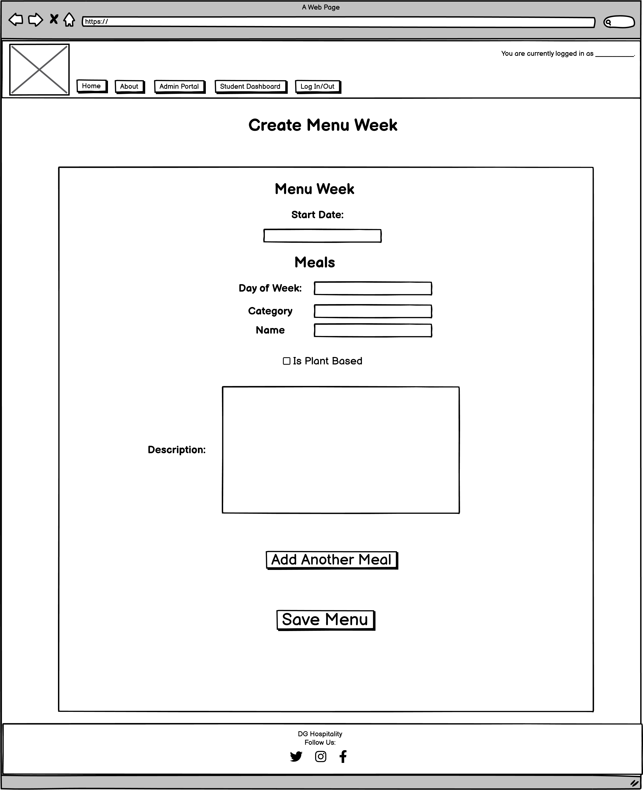
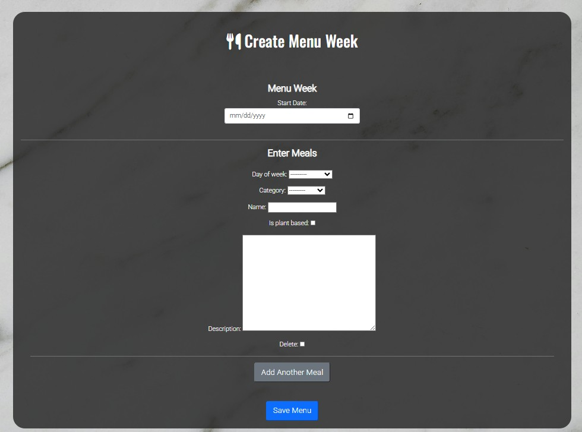
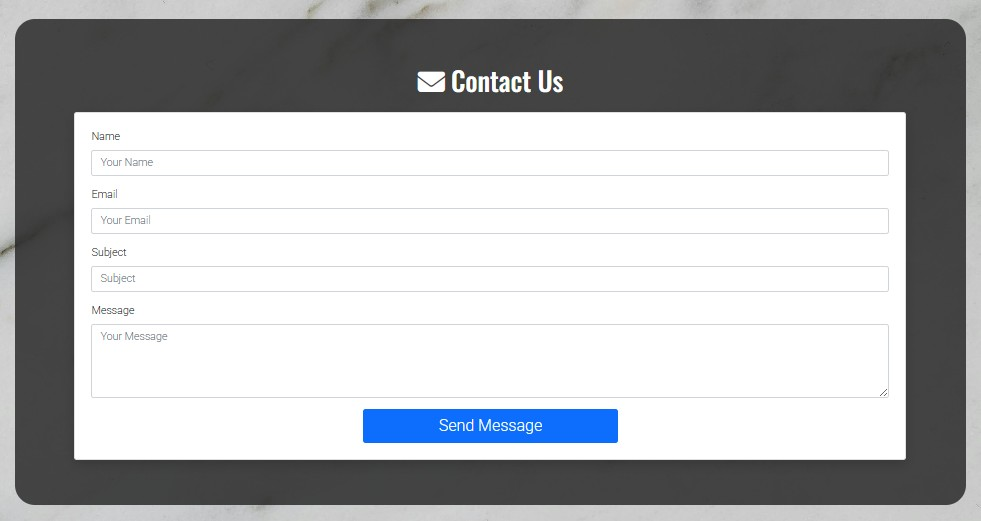

# DG Catering Student Meal Plan Portal

Link to Live Site: [DG Catering Student Meal Plan Portal](https://dg-student-ordering-system-3f18b93375de.herokuapp.com/)

## Index - Table of Contents
* [Introduction](#introduction)
* [User Experience (UX)](#user-experience-ux) 
    * [Site Goals](#site-goals) 
* [Design](#design)
    * [Colour](#colour)
    * [Fonts](#fonts)
    * [Background](#background-image)
    * [Wireframes](#wireframes)
    * [Database Design](#database-design-and-erd)
* [Features](#features)
    * [Logo & Navigation bar](#logo-and-navigation-bar)
    * [Home Page](#home-page)
    * [About Page](#about-page)
    * [Sample Menu Page](#sample-menu-page)
    * [Admin Menu Entry Page](#admin-menu-entry-page)
    * [Student Dashboard](#student-dashboard)
    * [Menu/Order Page](#menuorder-page)
    * [Past Orders Page](#past-orders-page)
    * [User Authentication Pages](#user-authentication-pages)
    * [Profile Update Page](#profile-update-page)
    * [Contact/Feedback Page](#contactfeeback-page)
    * [Future Features](#future-features)
* [Agile Methodology](#agile-methodology)
* [Technologies Used](#technologies-used)
    * [Languages](#languages)
    * [Frameworks, Libraries & Programs Used](#frameworks-libraries--programs-used)
* [Testing](#testing)
* [Deployment](#deployment)
    * [PostgreSQL Setup](#postgresql-setup)
    * [How This Site Was Deployed](#how-this-site-was-deployed)
    * [How to Clone The Repository](#how-to-clone-the-repository)
* [Credits](#credits)
    * [Photos](#photos)
    * [Code](#code)

## Introduction
The DG Catering Student Meal Plan Portal is designed as a tool for student's who are currently boarding at schools away from home that do not have an onsite catering option. 

This site has two overall goals. The first is to give parents a glimpse of the program and entice them to sign their children up for DG Catering's services. The second goal is that once a parent buys a catering package it will give student's who are signed up, a platform to place orders and view their order history - without any monetary exchange (as that is done separately with the parents via invoices right now). 

As mentioned above the site targets parents and students who could potentially benefit from meal deliveries to their dormoritory accomodations when away from home for their studies. 

## User Experience (UX)

### Site Goals

#### Site Owner Goals
As the site Owner, I want to create a website that:
1. is visually appealing.
2. is easily navigable.
3. provides adequate information to entice parents into signing up for services for their children. 

#### User Goals
As a First-Time user I want to:
1. easily understand the purpose of the site.
2. quickly be able to view relavant information, including price and sample menu.
3. easily register for an account. 

As a Returning User I want to:
1. be able to quickly log in.
2. be directed to a section of the website that allows me to easily place/update orders.
3. be able to view my previous orders.
4. submit a new order easily, and be able to see that it submitted successfully.

## Design

### Colour
The colour scheme for this website is mainly shades of black and white with the color mainly coming from the food photos. The black and white colour scheme conveys a sense of professionalism and cleanliness, which are important qualities for a catering company. Also, by reserving the more vibrant colours on the site for the photos of the food and the navigation buttons, it allows for easy recongition of important buttons for the user experience and allows the food to stand out better and impress potential clients. 

### Fonts
Google Fonts was used to import the Roboto and Oswald fonts. These were chosen as they complement each other well and have a youthful yet professional appearance. 

### Background Image
A background image is used across all pages of the site for consistency. It is meant to simulate a marble countertop. 

### Wireframes

The  wireframes were created in Balsamiq to outline the basic structure of the site. These wireframes were kept simple, reflecting a clean professional minimalist design approach.

Home Page

About Page

Sample Menu Page

Student Dashboard Page

Menu/Order Page

Past Orders Page

Create New Menu Form

### Database Design and ERD
The databse for the  ***DG Catering Student Meal Plan Protal** is designed to efficiently manage meal selections, user preferences, and ordering history while ensuring flexibility for weekly menu updates.

The core entities in the database include:

- Users: Represents students managing meal selections. Users are linked to their respective meal orders.
- MenuWeek: Defines the available meal plan for a specific week, ensuring that meal options are updated regularly.
- MealType: Categorizes meals into breakfast, lunch, or dinner, providing structure to daily meal plans.
- Meals: Stores individual meal options for each day of the week, including dietary specifications like plant-based options. Each meal is associated with a MenuWeek and a MealType.
- Orders: Represents a student’s meal selections for a given week. Each order is unique to a user and a specific MenuWeek.
- OrderItems: Links meals to an order, allowing students to customize selections and add dietary notes.

This relational structure ensures data integrity and allows for efficient retrieval of meal plans, past orders, and dietary customizations.

## Features

### Logo and Navigation Bar
- A simple and interactive Logo and Navigation Bar are located at the top of each page.
- The Logo links back to the homepage from any page throughout the site as this is a behaviour that would be expected by the user.
- The navigation bar is located in the same position on each page and provides links to various pages of the website depending on the user's authentication status. 
    - If an unauthenticated user is visiting the site, the navigation bar provides access to the Home page, About page, Registration page, and Log In page.
    - If an authenticated user is visiting the site, the navigation bar provides access to the Home page, About page, Student_Dashboard page, and a Log Out page. 
- The page that the user is actively using is coloured differently in the navigation bar to provide a clear view of which page they are currently on.
- The color of the text changes slightly for each page name as the mouse hovers over it to assist in easy navigation for the user.
- There is an additional section of the navigation bar that contains text that updates depending on a user's authentication status to let them know if they are logged in or not - and who they are logged in as if that is the case. 
- The navigation bar is fully responsive on all screen sizes and collapses to a toggler on smaller screen sizes for ease of use.

### Home Page
- The Home page conatins a hero image and text overlay that clearly communicates the purpose of the website.
- A button stating "View Pricing/Sample Menu" is also included in the text overlay as a call to action for the user. This serves as a quick link to the About Us page where pricing information is readily accessible and a sample menu can be accessed. 

- Below the hero image is a small section with some basic information about the company and a few key points to help sell our services. The text is black on a very light marble background for simplicity and a clean look. 

### About Page
- The About page is designed to give potential clients a bit more detail. It contains pricing information, some text about what the site will be used for once they purchase a package, and a link to a sample menu. 
- The About page also contains a small gallery of food images to showcase the delicious healthy meals they can expect to receive. 

### Sample Menu Page
- The sample menu page is very simple and mimics excatly what the regular order page will look like for students - without the ability to actually select options and submit the order. 
- The colour scheme is black and white to allow for good contrast and a simple clean design. 

### Admin Menu Entry Page
- The Menu Entry Page is styled similarly to the Menu pages to maintain a consistent look. 
- This page contains a form that allows admin users to create a new weekly menu in a more user-friendly format. 
- It contains Javascript code that dynamically adds new forms to the menu for each new meal to enhance user experience.

### Student Dashboard
- The Student Dashboard is accessible only to authenticated users and provides a quick, easily navigable space for students to place orders, view existing and past orders, update their profile information, and send a message. 
- The page is broken into a grid pattern and has colorful buttons to catch the user's attention. 
- The page also contains a heading that displays the text "Welcome (username)!" to create a more personalized experience. 

### Menu/Order Page
- The Menu/Order page is designed in the same way as the sample menu, with a black and white colour scheme for cleanliness and simplicity. 
- Users are able to select a meal with radio buttons and add dietary notes if they wish. 
- This page also functions as the update menu page, and will pre-populate the fields if users have already made selections for that menu week, which helps prevent double orders. 

### Past Orders Page
- The Past Orders page contains expandle boxes that show what weeks you have placed orders for in the past. 
- The page contains a button that allows you to toggle to expand the order details and view the actual meals that were ordered.
- There is an update and delete button also available to the user, that will only display if the menu start date is after today - to avoid users deleting or updating menus for weeks that are already in progress or in the past. 

- The delete option also includes a buffer modal that will confirm with the user that they are certain they wish to delete their order.

### User Authentication Pages
- The site contains three main user authentication pages: Registration, Log In, and Log Out.
- They are all styled consistently in a black and white theme. 
- The sign out feature also contains a buffer page to confirm the user's desire to sign out of their account. 

### Profile Update Page
- The profile update page contains a form where users are able to manipulate backend user data from the portal.

### Contact/Feeback Page
- The contact page conatins a form that will allow the user to send an email to the admin team. At the moment it prints the form data to the terminal and can be wired up to actually interact with an email system later.

### User Feedback Messages
- Feedback messages are present throughout the site to confirm to a user that they were successful in signing in, signing out, placing an order, updating an order, updating their profile, etc. 

### Future Features
1. An Admin Portal Page- structured similarly to the Student Dashboard. Admins could have various options to create (via the existing create new menus form), update, or delete menus.
2. A feature to create a Parent/Guardian account that would provide access so parents could view their children's order history.
3. Implement the option for different meal plan options and have the menus udpate to provide users only with options that are inline with their chosen mealplan. 

## Agile Methodology

This project was developed using the AGILE Methodology and a [Project Kanban Board](https://github.com/users/MichelleDuda/projects/4/views/1). This approach helped to create a systematic approach to building my site while allowing for flexibility for priority based decision making. 

In order to effectively manage the development, I utilized GitHub Projects, and was able to break tasks down into user stories for better manageability. As the issues were addressed they were moved from the to-do list to the in progress section, where commit messages were tied to them before they were closed out after the features were tested and deployed. 

## Technologies Used

### Languages
- HTML
- CSS
- Javascript
- Python

### Frameworks, Libraries & Programs Used
- [Heruko](https://www.heroku.com/) was used to deploy this project.
- [Visual Studio](https://code.visualstudio.com/) was the local IDE utilized for development. 
- [GitHub](https://github.com/) was used for version control and code hosting.
- [Google Fonts](https://fonts.google.com) was used for the fonts: Oswald and Lato.
- [Font Awesome](https://fontawesome.com/) was used for various icons in the footer and headings of the pages. 
- [Balsamiq](https://balsamiq.com/) was used to create the wireframes.
- [Lucid Chart](https://www.lucidchart.com/) was used to creat the Entity Relationship Diagram
- [CI Python Linter](https://pep8ci.herokuapp.com/)
- [CSS-Valitador](#https://jigsaw.w3.org/css-validator/) was used for CSS validation
- [W3C](https://validator.w3.org/) was used for HTML validation
- PostgreSQL
- [Django](https://www.djangoproject.com/) was used as the backend framework.
- Bootstrap
- Django Widget-Tweaks
- Django AllAuth
- OAuthLib
- Gunicorn
- Whitenoise

## Testing
For detailed testing results, refer to the [Testing Documentation](TESTING.md)

## Deployment

### PostgreSQL Setup
1. Create a New Database Instance
2. Retrieve Database URL from your account dashboard.
3. Store the Database URL in env.py file as follows:
        import os
        os.environ["DATABASE_URL"] = "<your_postgres_connection_url>"
4. Ensure your env.py file is in gitignore
5. Add DATABASE_URL to Heroku Config Vars by navigating to Settings>Reveal Config Vars and adding:  
    - Key: `DATABASE_URL`  
    - Value: `<your_postgres_connection_url>`  

### How This Site Was Deployed
This site was deployed via Heroku.
1. Log into Heroku (https://www.heroku.com).
2. Click on Create 'New App' button.
3. Name the app & choose your region. Click 'Create App' button.
4. Go to the Settings Tab.
5. In the Config Vars section, click 'Reveal Config Vars' button.
6. Enter DATASE_URL in the key field and enter the actual URL in the value field. Then click 'Add' button.
7. Entrer SECRET_KEY in the key field and enter the actual secret key in the value field. Then click 'Add' button.
9. Go to the Deploy Tab.
10. Select GitHub in the Deployment Method section.
11. Confirm to connect to GitHub.
12. Search for repository name and click Connect.
13. Make sure branch is set to main and click 'Deploy Branch' button in Manual Deploy section. .

### How to Clone the Repository

To Clone this repository:
1. Navigate to [https://github.com/MichelleDuda/dg-student-ordering-system](https://github.com/MichelleDuda/dg-student-ordering-system).
2. Click on the "<> Code" button.
3. Copy the URL for the repository using HTTPS, SSH, or GitHub CLI. 
4. Open Git Bash.
5. Change the working directory to the location you want to clone the directory to. 
6. Type git clone and paste the URL that was copied earlier. 
7. Press Enter to begin the clone process. 

## Credits

### Photos
1. [hero.webp](https://www.pexels.com/photo/salmon-dish-with-vegetables-1516415/) by Valeria Boltneva from Pexels. 
2. [background.webp](https://www.pexels.com/photo/close-up-photo-of-a-marble-surface-6634150/) by Kaboompics.com from Pexels. 
3. [chicken.webp](https://www.pexels.com/photo/close-up-photo-of-tasty-looking-cuisine-1860204/) by Valeria Boltneva from Pexels. 
4. [fish.webp](https://www.pexels.com/photo/fish-salad-dish-262959/) by Dana Tentis from Pexels. 
5. [muffin.webp](https://www.pexels.com/photo/cooked-food-65172/) by Mali Maeder from Pexels. 
6. [omelette.webp](https://www.pexels.com/photo/selective-focus-photography-of-omelette-with-toppings-1437268/) by Engin Akyurt from Pexels. 
7. [parfait.webp](https://www.pexels.com/photo/a-dessert-in-a-glass-7994282/) by Ecrin from Pexels. 
8. [pasta.webp](https://www.pexels.com/photo/selective-focus-photography-of-pasta-with-tomato-and-basil-1279330/) by Lisa from Pexels. 
9. [salad.webp](https://www.pexels.com/photo/a-bowl-of-food-with-vegetables-and-meat-on-it-27969844/) by Valeria Boltneva from Pexels. 
10. [steak.webp](https://www.pexels.com/photo/steak-food-769289/) by Malidate Van from Pexels. 

### Code

1. [TabletoMarkdown.com](https://tabletomarkdown.com/convert-spreadsheet-to-markdown/) was used to convert my additional manual testing table from an excel spreadsheet to markdown.
2. [Custom Template Tags](https://docs.djangoproject.com/en/5.1/howto/custom-template-tags/) was used to assist in creating the custom filter code for get_item.
3. [Djano Documentation](https://docs.djangoproject.com/en/5.1/intro/) was used extensively to create various componenets of this project. 
4. [Geeks for Geeks](https://www.geeksforgeeks.org/how-to-use-get-or-create-in-django/) was used to understand the functionality of get or create functions to retrieve and create menus. 
5. [W3 Schools](https://www.w3schools.com/django/ref_filters_dictsort.php#:~:text=The%20dictsort%20filter%20sorts%20a,dictsortreversed%20filter%20to%20sort%20descending.) was used for DICTSORT.
6. [Masting-Django-Admin](https://mastering-django-admin.avilpage.com/en/latest/admin_filter.html) was used to help create the Django Admin Filters and Display Lists
7. [SimpleisBetterThanComplex](https://simpleisbetterthancomplex.com/2015/12/04/package-of-the-week-django-widget-tweaks.html) and [PYPI.org](https://pypi.org/project/django-widget-tweaks/) used to aid in the use of widget tweaks for forms.
8. [Mozilla Developer](https://developer.mozilla.org/en-US/docs/Web/JavaScript/Guide/Regular_expressions), [Stackoverflow](https://stackoverflow.com/questions/5297876/clone-form-and-increment-id?utm_source=chatgpt.com) to set up dynamically adding new forms to a formset via Javascript. 
