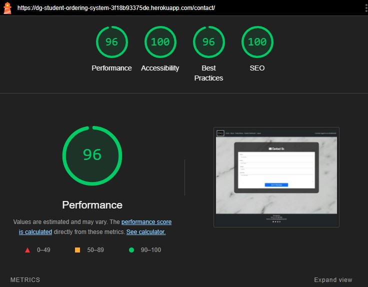
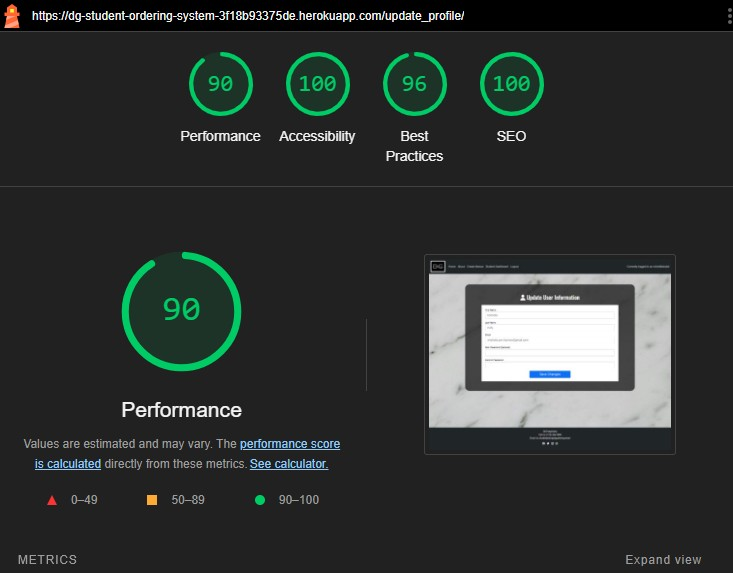

# DG Catering Student Meal Plan Portal Testing

* [Validator Testing](#validator-testing)
* [Lighthouse Testing](#lighthouse-testing)
* [Additional Manual Testing](#additional-manual-testing)
* [User Story Testing](#user-story-testing)
* [Browser Compatibility](#browser-compatibility)
* [Bugs](#bugs)
* [Known Bugs](#known-bugs)

## Validator Testing

### HTML Validation
The following files all passed through the [HTML Validator](https://validator.w3.org/nu/#textarea) with no errors:

- index.html [Full Results](static/documentation/testing/validator_results/html_home.pdf)
- student_dashboard.html [Full Results](static/documentation/testing/validator_results/html_student_dashboard.pdf)
- menu.html [Full Results](static/documentation/testing/validator_results/html_menu.pdf)
- update_profile.html [Full Results](static/documentation/testing/validator_results/html_update_profile.pdf)
- login.html [Full Results](static/documentation/testing/validator_results/html_login.pdf)
- logout.html [Full Results](static/documentation/testing/validator_results/html_logout.pdf)
- new_menu_form.html [Full Results](static/documentation/testing/validator_results/html_create_menu.pdf)
- contact.html [Full Results](static/documentation/testing/validator_results/html_contact.pdf)

The following html file returned an error:

- past_orders.html [Full Results](static/documentation/testing/validator_results/html_past_orders.pdf)
- This error is not actually valid as the action is processed via Javascript to dynamically update the deletion URL. 

### CSS Validation
The style.css file passed through the [CSS Validator](https://jigsaw.w3.org/css-validator/#validate_by_input) with no errors:

[Full Results](static/documentation/testing/validator_results/css_validator.pdf)

### Javascript Validation

- [Javascript Validator](https://jshint.com)
  - Code from script.js passed through JSHint site with no errors. The following Metrics were logged: There are 9 functions in this file. Function with the largest signature take 1 arguments, while the median is 0. Largest function has 7 statements in it, while the median is 2. The most complex function has a cyclomatic complexity value of 2 while the median is 1.

### Python DeLinter
The following files all passed through the [Python PEP8 Linter](https://pep8ci.herokuapp.com/) with no errors:
    

urls.py

     
    

    

order/forms.py

     
    

    

order/views.py

     
    

    

order/models.py

     
    

    

order/admin.py

     
    

    

order/custom_filters.py

     
    

    

menu/views.py

     
    
 
    

menu/forms.py

     
    

    

about/views.py

     
    

    

about/menu_data.py

     
    
    

The following file passed through with no errors on customized code. However, preloaded built in code had a few errors for line length:
    

settings.py

     
    

 
## Lighthouse Testing
- Lighthouse result for index.html

    

- Lighthouse result for about.html

    

- Lighthouse result for contact.html

    

- Lighthouse result for menu.html

    

- Lighthouse result for past_orders.html

    

- Lighthouse result for signup.html

    

- Lighthouse result for sample_menu.html

    

- Lighthouse result for login.html

    

- Lighthouse result for student_dashboard.html

    

- Lighthouse result for update_profile.html

    

## Additional Manual Testing

### Navigation - Navbar
| Feature Tested         | Steps                                                 | Expected Outcome                                                                                                              | Results |
| ---------------------- | ----------------------------------------------------- | ----------------------------------------------------------------------------------------------------------------------------- | ------- |
| Home Link Icon         | While not on the homepage, click the DG Catering Logo | User is redirected to the homepage.                                                                                           | Pass    |
| Home Link              | White not on the homepage click "Home"                | User is redirected to the homepage.                                                                                           | Pass    |
| About Link             | While not on the about page click "About"             | User is redirected to the about page.                                                                                         | Pass    |
| Registration Link      | While not authenticated click "Register"              | User is redirected to the Sign Up page.                                                                                       | Pass    |
| Login Link             | While not authenticated click "Login"                 | User is redirected to the Login page.                                                                                         | Pass    |
| Student Dashboard Link | While authenticated click "Student Dashboard"         | User is redirected to the Student Dashboard page.                                                                             | Pass    |
| Logout Link            | While authenticated click "Logout"                    | User is directed to a buffer page to confirm logout. Clicking the Logout Button again will log the user out of their account. | Pass    |

### Navigation - Other
| Feature Tested                  | Steps                                                                                   | Expected Outcome                                                                                                                                                                                                                                                                                  | Results |
| ------------------------------- | --------------------------------------------------------------------------------------- | ------------------------------------------------------------------------------------------------------------------------------------------------------------------------------------------------------------------------------------------------------------------------------------------------- | ------- |
| View Pricing/Sample Menu Button | While on the homepage click the "View Pricing/Sample Menu" button                       | User is redirected to About page.                                                                                                                                                                                                                                                                 | Pass    |
| View Sample Menu Button         | While on the About page click the "View Sample Menu" button                             | User is redirected to Sample Menu page that is populated with sample meal data for one week.                                                                                                                                                                                                      | Pass    |
| Login Redirect                  | While unauthenticated click on the "login" link and sign in with username and password. | User is redirected to the Student-Dashboard.                                                                                                                                                                                                                                                      | Pass    |
| Order Now Button                | While on the Student Dashboard page click the "Order Now" button                        | User is redirected to the Menu page. It will pull up a menu for the following week, where a user can make selections and enter dietary notes. If a user has already entered an order for the upcoming week. The fields will pre-populate with their choices - which they can update if they wish. | Pass    |
| View Orders Button              | While on the Student Dashboard page click the "View Orders" button                      | User is redirected to the Past Orders page.                                                                                                                                                                                                                                                       | Pass    |
| Update Profile Button           | While on the Student Dashboard page click the "Update Info" button                      | User is redirected to the Update Profile page.                                                                                                                                                                                                                                                    | Pass    |
| Give Feedback Button            | While on the Student Dashboard page click the "Give Feedback" button                    | User is redirected to the Contact page                                                                                                                                                                                                                                                            | Pass    |

### CRUD - Create Order (User)
|        | Feature Tested         | Steps                                                                                                                                                                                                                 | Expected Outcome                                                                                                                                                                                                                                                                                                                                         | Results |
| ------ | ---------------------- | --------------------------------------------------------------------------------------------------------------------------------------------------------------------------------------------------------------------- | -------------------------------------------------------------------------------------------------------------------------------------------------------------------------------------------------------------------------------------------------------------------------------------------------------------------------------------------------------- | ------- |
| Create |                        |                                                                                                                                                                                                                       |                                                                                                                                                                                                                                                                                                                                                          |         |
|        | Place Order            | While logged in, click on the Student Dashboard link and the Order Now button.                                                                                                                                        | User is redirected to the Menu page.                                                                                                                                                                                                                                                                                                                     | Pass    |
|        | Add items to order     | For each meal type associated with each day of the week, select the radio button next to one of the available options. Type text in the dietary notes field. Click the "Place Order" button at the bottom of the menu | User is redirected to the Past Orders Page which is now populated with their latest order. A banner is displayed to let them know the order has been placed successfully.                                                                                                                                                                                | Pass    |
|        |                        |                                                                                                                                                                                                                       |                                                                                                                                                                                                                                                                                                                                                          |         |
| Read   |                        |                                                                                                                                                                                                                       |                                                                                                                                                                                                                                                                                                                                                          |         |
|        | View Past Orders       | While logged in, click on the Student Dashboard link and the View Orders Button                                                                                                                                       | User is redirected to the Past Orders page where they can view all orders they have placed previously                                                                                                                                                                                                                                                    | Pass    |
|        | Expand Order Details   | While on the Past Orders page, click on the "View Order Details" button.                                                                                                                                              | The container for the order the user has selected will expand and list the items associated with that order. The button will change in appearance and now state hide order details.                                                                                                                                                                      | Pass    |
|        | Collapse Order Details | While on the Past Orders page with Order Details expanded, click on the "Hide Order Details" button                                                                                                                   | The container will collapse and only display the heading with the order date and menu week. The "Hide Order Details" button will change in appearance and state "View Order Details"                                                                                                                                                                     | Pass    |
|        |                        |                                                                                                                                                                                                                       |                                                                                                                                                                                                                                                                                                                                                          |         |
| Update |                        |                                                                                                                                                                                                                       |                                                                                                                                                                                                                                                                                                                                                          |         |
|        | Order Update Button    | While logged in, click on the Student Dashboard link and click the "Past Orders" button.                                                                                                                              | If an order exists for the following week, an update button will appear in the container holding the order details. If the week has already begun the order is locked and the button will not appear.                                                                                                                                                    | Pass    |
|        | Order Item Update      | While on the Past Orders page if an editable order exists, click the Update button. Make changes to selections and click Place Order button.                                                                          | User will be redirected to the menu page with the form pre-populated with the users previous choices. Once the user makes updates and clicks the "Place Order" button, they will be redirected to the Past Orders screen, a message will appear stating the order was updated successfully, and the new selections will be visible in the order details. | Pass    |
| Delete |                        |                                                                                                                                                                                                                       |                                                                                                                                                                                                                                                                                                                                                          |         |
|        | Order Delete Button    | While logged in, click on the Student Dashboard link and click the "Past Orders" button.                                                                                                                              | If an order exists for the following week, a delete button will appear in the container holding the order details. If the week has already begun the order is locked and the button will not appear.                                                                                                                                                     | Pass    |
|        | Order Deletion         | While on the Past Orders page, if an order exists that is able to be deleted, click the Delete button.                                                                                                                | A modal will pop up on the screen asking the user to confirm the deletion. If they click close the order will not be deleted. If they click delete the order will delete and redirect them to the Past Orders page where a banner will display a message stating it was successful and the updates will be visible.                                      | Pass    |

### Additional Manual Testing
|                     | Feature Tested                   | Steps                                                                                    | Expected Outcome                                                                                                                                                                                                   | Results |
| ------------------- | -------------------------------- | ---------------------------------------------------------------------------------------- | ------------------------------------------------------------------------------------------------------------------------------------------------------------------------------------------------------------------ | ------- |
| Sign Up             |                                  |                                                                                          |                                                                                                                                                                                                                    |         |
|                     | Sign up Form                     | As an unauthenticated user go to the Register link in the navigation bar.                | The sign up form is displayed with username, email, and password fields.                                                                                                                                           | Pass    |
|                     | Submit Button                    | Fill in the registration form and click "Sign Up"                                        | A success message appears and the user is redirected to the Student Dashboard.  The navbar text changes to say they are logged in as "username"                                                                    | Pass    |
| Log In              |                                  |                                                                                          |                                                                                                                                                                                                                    |         |
|                     | Log In Form                      | As an unauthenticated user, go to the log in link in the navigation bar.                 | The log in form is displayed with username and password fields.                                                                                                                                                    | Pass    |
|                     | Log In Button                    | Fill in the sign in form and click "Sign In"                                             | User is redirected to the Student Dashboard and a banner appears saying they have successfully logged in. The navbar text changes to say they are logged in as "username"                                          | Pass    |
| Log Out             |                                  |                                                                                          |                                                                                                                                                                                                                    |         |
|                     | Log Out Link                     | As an authenticated user, click the Logout link in the navigation bar.                   | User will be redirected to a buffer confirming if they want to sign out.                                                                                                                                           | Pass    |
|                     | Sign Out Button                  | Click the "Sign Out" button                                                              | The User will be logged out of their account and redirected to the homepage. A banner will display stating the log out was successful and the navbar text will change to say that you are not currently logged in. | Pass    |
|                     |                                  |                                                                                          |                                                                                                                                                                                                                    |         |
| Update User Info    |                                  |                                                                                          |                                                                                                                                                                                                                    |         |
|                     | Update Profile Button            | As an authenticated user, from the Student Dashboard, click on "Update Profile" button.  | User will be redirected to the update user form.                                                                                                                                                                   |         |
|                     | Update Name                      | Add or Update your First and Last Name & Click Save Changes                              | User will be redirected back to Student Dashboard and see a banner stating that the information was updated successfully.                                                                                          | Pass    |
|                     | Update Email                     | Add or Update your Email Address                                                         | User will be redirected back to Student Dashboard and see a banner stating that the information was updated successfully.                                                                                          | Pass    |
|                     | Update Email - Validation        | Enter an incorrect email that is missing the @ sign                                      | User will receive an error that the email must be formatted properly                                                                                                                                               | Pass    |
|                     | Update Email - Validation        | Enter an incorrect email that has an @ symbol but is missing a .com or .net              | User will receive an error banner that an Error Occurred. Enter a valid email address                                                                                                                              | Pass    |
|                     | Update Password                  | Add a new password and confirm it.                                                       | User will be redirected back to Student Dashboard and see a banner stating that the information was updated successfully.                                                                                          | Pass    |
|                     | Update Password - Validation     | Add a new password and a mis-matched confirmation password.                              | User will receive an error banner that an Error Occurred. Passwords Do Not Match                                                                                                                                   | Pass    |
| Admin Menu Creation |                                  |                                                                                          |                                                                                                                                                                                                                    |
|                     | Create New Menus Navigation Link | Log into a staff or superuser account                                                    | When logged into a staff or superuser account the navigation bar contains an additional link to "Create  Menus"                                                                                                    | Pass    |
|                     | Create New Menus Navigation Link | Log into a regular user account                                                          | The navigation bar should not contain the additional "Create Menus" link                                                                                                                                           | Pass    |
|                     | Create New Menus Navigation Link | As an authenticated superuser, click on the Create Menus link                            | User is redirected to the custom form to create a new menu.                                                                                                                                                        | Pass    |
|                     | Error Checking                   | Submit the Form without adding a start date                                              | User will receive an error stating they need to fill out the required field                                                                                                                                        | Pass    |
|                     | Error Checking                   | Submit the Form without adding a day of the week                                         | User will receive an error stating they need to fill out the required field                                                                                                                                        | Pass    |
|                     | Error Checking                   | Submit the Form without adding a meal category                                           | User will receive an error stating they need to fill out the required field                                                                                                                                        | Pass    |
|                     | Error Checking                   | Submit the Form without adding a meal name                                               | User will receive an error stating they need to fill out the required field                                                                                                                                        | Pass    |
|                     | Add Another Meal Button          | Click the Add Another Meal Button                                                        | A new form will be added dynamically when the button is pressed so a user can enter an additional meal field. This will happen for a maximum of 50 meals.                                                          | Pass    |
|                     | Save Menu Button                 | Add valid data in all required form fields and click Save Menu                           | User will be redirected to the home page and receive a message that the menu was created successfully                                                                                                              | Pass    |
| Feedback Form       |                                  |                                                                                          |                                                                                                                                                                                                                    |         |
|                     | Feedback Button                  | When logged in navigate to the Student Dashboard and click on the "Give Feedback" button | User will be redirected to a contact form.                                                                                                                                                                         | Pass    |
|                     | Submit Form                      | After filling in the form fields click the Submit button                                 | Form will be printed to the terminal and user will receive a message that their form was submitted successfully.                                                                                                   | Pass    |

## User Story Testing

### Site Owner Goals
  
## User Goals

## Browser Compatibility
This website was tested on the following browsers:
- Google Chrome Version 129.0.6668.103 (Official Build) (64-bit)
- Microsoft Edge Version 130.0.2849.46 (Official build) (64-bit)
- Mozilla Firefox Version 128.0.3 (64-bit)

## Bugs

## Known Bugs
There are no unaddressed known bugs at this time. 
  

